<div align="center">

# 👋 Olá, eu sou **Marcos André Costa da Silva**

### 🚀 Desenvolvedor Backend | Estudante de Sistemas de Informação | Especialista em Java & Spring


[](https://www.linkedin.com/in/marcos-andr%C3%A9-costa-da-silva-51807625a)
[](mailto:marcosdev2002@gmail.com)
[](https://github.com/devopMarkz)

</div>

---

## 🎯 **Sobre Mim**

```java
public class MarcosAndre extends Developer {
    
    private String currentRole = "Backend Developer";
    private String company = "Geosite";
    private String education = "Sistemas de Informação - 7º Período";
    private String[] currentFocus = {"Microsserviços", "Spring Cloud", "Vue.js"};
    private String methodology = "Scrum";
    
    public String[] getSkills() {
        return new String[]{
            "Java 8+", "Spring Boot", "Spring Cloud", "JPA/Hibernate",
            "REST APIs", "JWT/OAuth2", "Microsserviços", "Docker", 
            "Spring Security", "TDD/JUnit/Mockito", "PostgreSQL", "Vue.js"
        };
    }
    
    public String getCurrentProject() {
        return "Desenvolvendo serviços de geolocalização com foco em arquitetura de microsserviços";
    }
}
```

<details>
<summary>📚 <strong>Formação Acadêmica</strong></summary>

- 🎓 **Bacharelado em Sistemas de Informação** - 7º Período
- 📖 Focado em **Engenharia de Software**, **Arquitetura de Sistemas** e **Desenvolvimento Web**
- 🔬 Projetos acadêmicos e profissionais envolvendo **desenvolvimento full-stack** e **metodologias ágeis**

</details>

---

## 💼 **Experiência Profissional**

<table align="center">
<tr>
<td width="450px" align="left">

### 🏢 **Geosite** - *Desenvolvedor Backend*
- 🔭 Desenvolvimento com **Vue 2** e **Java 8**
- 🗺️ Criação de **serviços de geolocalização**
- ⚡ Aplicação de **metodologias ágeis (Scrum)**
- 🏗️ Foco em **arquitetura de microsserviços**

</td>
<td width="450px" align="left">

### 🎯 **Objetivos Atuais**
- 🛡️ Aprofundamento em **Resiliência** e **Circuit Breakers**
- 📊 Estudos em **Observabilidade** e **Monitoramento**
- 📨 Especialização em **Messageria** (Kafka e RabbitMQ)
- 🏗️ Evolução em **Arquitetura de Software**

</td>
</tr>
</table>

---

## 🛠️ **Stack Tecnológica**

<div align="center">

### **Backend Development**


### **Message Brokers & Streaming**


### **Frontend Development**


### **Databases**


### **DevOps & Tools**


</div>

---

## 📊 **Estatísticas GitHub**

<div align="center">
<table>
<tr>
<td width="50%">


</td>
<td width="50%">


</td>
</tr>
</table>


</div>

---

## 🏆 **Projetos em Destaque**

<div align="center">

| 🚀 **Projeto** | 📝 **Descrição** | 🛠️ **Tecnologias** | 🔗 **Link** |
|:---:|:---:|:---:|:---:|
| **Sistema de Gestão de Finanças** | sistema web seguro e simples para gerenciar receitas, despesas, categorias e contas recorrentes | Java, Spring, PostgreSQL, Vue.js 2 | [Ver Projeto](https://gestao-financas-lac.vercel.app/login) |
| **API de Microsserviços** | Arquitetura distribuída com Spring Cloud | Eureka, Docker, API Gateway, Auth Server, Padrão SAGA, PostreSQL | [Ver Projeto](https://github.com/devopMarkz/Gerenciamento_Pedidos) |
| **Cálculo de Frete** | Interface responsiva, focada no uso em celulares. Pronto para Android/iOS via Capacitor. | Vue.js 2, Spring, PostgreSQL, JWT | [Ver Projeto](https://liq-frota.vercel.app/login) |
| **Sistema de Aluguel de Quadras** | Sistema web para aluguel de quadras esportivas. | Java, Spring, PostgreSQL, JWT, Vue.js 2 | [Ver Projeto](https://github.com/devopMarkz/Reservou_App) |

</div>

---

## 🎓 **Certificações & Cursos**

<details>
<summary>📜 <strong>Certificações Obtidas</strong></summary>

- ☕ **Java COMPLETO - Programação Orientada a Objetos + Projetos** *(54.5 horas - Concluído)*
- ☕ **SOLID com JAVA: Princípios da Programação Orientada a Objetos** *(8 horas - Concluído)*
- 🍃 **Java Spring Professional** *(120 horas - Concluído)*
- 🐳 **Spring BootExpert: JPA, REST, JWT, OAuth2 com Docker e AWS** *(52 horas - Concluído)*
- ☕ **Java Unit Testing com Spring Boot 3, TDD, Junit 5 e Mockito** *(17h - Concluído)*
- ☕ **Microsserviços 2025 c. Spring Cloud Boot Kubernetes e Docker** *(43.5h - Concluído)*
- 🍃 **Especialista JPA** *(32 horas - Em andamento)*
- 📊 **Especialista em Microsserviços - AlgaWorks** - *(+70 horas - Em andamento)*

</details>

---

## 🎯 **Objetivos de Carreira**

```mermaid
graph LR
    A[Desenvolvedor Backend] --> B[Arquiteto de Software]
    B --> C[Tech Lead]
    
    A --> D[Especialização em Microsserviços]
    A --> E[Cloud Computing]
    A --> F[DevOps]
```

<div align="center">



</div>

### 📈 **Próximos Passos**
- 🎯 Certificação **AWS Solutions Architect**
- 🌐 Especialização em **arquitetura de microsserviços**
- 📚 Conclusão da graduação com **excelência acadêmica**

---

## 📞 **Vamos Conectar?**

<div align="center">

<a href="https://www.linkedin.com/in/marcos-andr%C3%A9-costa-da-silva-51807625a" target="_blank">

</a>

<a href="mailto:marcosdev2002@gmail.com">

</a>

<a href="https://github.com/devopMarkz">

</a>

</div>

---


**💡 "Código limpo não é escrito seguindo regras. Código limpo é escrito por programadores que se importam."** - *Robert C. Martin*

</div>
